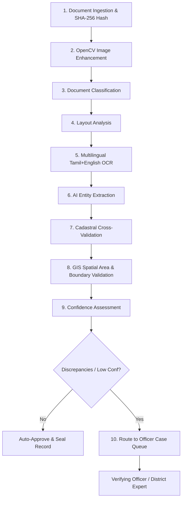

# BHOOMI AI — Intelligent Land Record Digitization & Validation System
### Smart India Hackathon (SIH 2026) | Problem Code: SIH26018


---

## 🏛️ System Architecture

```
                       React Frontend (Port 5173)
                                   |
                                   | REST API (JWT Authenticated)
                                   v
             Node.js + Express Orchestrator Backend (Port 5000)
             |
             +-----> MongoDB (Local / Atlas)
             |       - Users (7 RBAC Roles)
             |       - Documents (SHA-256 Hashed)
             |       - ProcessingJobs (10 Live Stages)
             |       - Parcels (Tamil Nadu Cadastral Registry + GeoJSON)
             |       - Discrepancies (Categorized Mismatches)
             |       - Cases (Officer Review Workflow)
             |       - AuditLogs (Chained SHA-256 Provenance)
             |
             +-----> Local Immutable Storage (`uploads/originals/`)
             |
             | HTTP REST (`POST /api/v1/process-document`)
             v
       Python FastAPI AI Processing Microservice (Port 8000)
             |
             +-- 1. Image Preprocessing (OpenCV CLAHE / Bilateral Filter / Deskew)
             +-- 2. Document Classification (Patta, Chitta, Adangal, Sale Deed)
             +-- 3. Multimodal OCR (Tamil + English via Gemini Vision)
             +-- 4. Entity Extraction (Survey No, Owner, Area, Boundaries)
             +-- 5. Confidence Analysis (Field-level + Weighted Overall)
             +-- 6. Scenario-Aware Demo Fallback Engine
```

---

## 🔄 End-to-End 10-Stage Pipeline



---

## 👥 7 Role-Based User Accounts (Pre-seeded)

Default Password for all demo accounts: **`Bhoomi@2026`**

| # | Role | Email | Name / Responsibilities |
|:---|:---|:---|:---|
| 1 | `FIELD_OPERATOR` | `operator@bhoomi.ai` | Karthik Subramanian (Uploads documents, initiates processing) |
| 2 | `VERIFYING_OFFICER` | `verifier@bhoomi.ai` | Ananya S. Iyer (Field validation, resolves standard discrepancies) |
| 3 | `DISTRICT_EXPERT` | `expert@bhoomi.ai` | Dr. R. Natarajan (Resolves critical conflicts, cadastral GIS reviews) |
| 4 | `DISTRICT_ADMIN` | `admin@bhoomi.ai` | P. Vijayaraghavan IAS (District analytics, officer workload monitor) |
| 5 | `CHIEF_AUDITOR` | `auditor@bhoomi.ai` | G. Meenakshi (Cryptographic SHA-256 chain audit & provenance inspection) |
| 6 | `CITIZEN` | `citizen@bhoomi.ai` | Muruganandham K. (View own submitted records & track approvals) |
| 7 | `SYSTEM_ADMIN` | `sysadmin@bhoomi.ai` | Bhoomi AI SuperAdmin (Full system health, users, configurations) |

---

## ⚡ Quick Start Guide

### 1. Prerequisites
- **Node.js**: v18.x or v22.x
- **Python**: 3.11.x or 3.12.x
- **MongoDB**: Local MongoDB on `mongodb://127.0.0.1:27017` or MongoDB Atlas URI

### 2. Node Backend Setup
```bash
cd backend
npm install
npm run seed     # Seeds users, Tamil Nadu parcels & genesis audit block
npm run dev      # Starts Express on http://localhost:5000
```

### 3. Python AI Microservice Setup
```bash
cd ai-service
pip install -r requirements.txt
uvicorn app.main:app --reload --port 8000  # Starts FastAPI on http://localhost:8000
```

---

## 🧪 Demo Scenarios for Live Evaluation

The backend provides built-in demo scenarios for judges and testing:

| Scenario Code | Simulated Condition | Outcome |
|:---|:---|:---|
| `CLEAN_RECORD` | Perfect match with reference registry | Status: `COMPLETED`, Auto-Sealed |
| `LOW_CONFIDENCE` | Degraded document (OCR confidence < 75%) | Status: `REVIEW_REQUIRED`, Flag: `LOW_CONFIDENCE` |
| `OWNERSHIP_CONFLICT` | Extracted owner differs from registry | Status: `REVIEW_REQUIRED`, Flag: `OWNER_MISMATCH` (HIGH) |
| `GIS_AREA_MISMATCH` | Document claims 2.45 Acres vs GIS 2.12 Acres (15.5% variance) | Status: `REVIEW_REQUIRED`, Stage 8 Flagged, Flag: `AREA_MISMATCH` |
| `DUPLICATE_RECORD` | Duplicate registration attempt | Status: `REVIEW_REQUIRED`, Flag: `DUPLICATE_RECORD` |
| `BOUNDARY_CONFLICT` | Overlap conflict with cadastral FMB map | Status: `REVIEW_REQUIRED`, Flag: `BOUNDARY_MISMATCH` (CRITICAL) |

---

## 🛡️ Tamper-Evident SHA-256 Hash Chain
Every single action (upload, OCR, validation, GIS check, discrepancy creation, officer decision) is appended to the audit ledger with chained cryptographic hashing:

$$\text{currentHash} = \text{SHA256}(\text{previousHash} \parallel \text{eventId} \parallel \text{action} \parallel \text{timestamp} \parallel \text{details})$$

Verification endpoint: `GET /api/v1/audit/verify-chain` verifies mathematical continuity from the genesis block.
